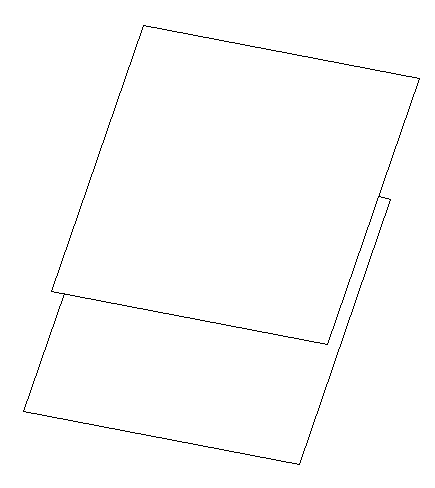
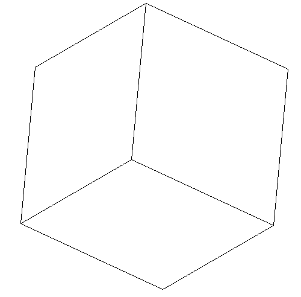
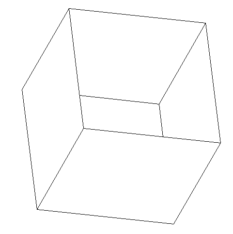

---
author: Д.О. Оберемок
date: 24.05.2024
title: Отчёт по теме «Изображение проекции полиэдра»
...

## Постановка задачи

82. Назовём точку в пространстве «хорошей», если её проекция находится 
строго вне квадрата единичной площади с центром в начале координат и 
сторонами, параллельными координатным осям. Модифицируйте эталонный 
проект таким образом, чтобы определялась и печаталась следующая 
характеристика полиэдра: сумма площадей проекций граней, не более двух 
вершин которых являются «хорошими» точками.

## Описание решения

В нашей задаче нужно реализовать метод, который будет считать площадь
всех граней. Для этого реализуем в классе Polyedr метод count_area,
который будет выполнять поставленную задачу.

В методе count_area мы рассматриваем все грани с начальными координатами
(мы ранее отдельно создали списки, где хранятся вершины, рёбра и грани
с непреобразованными координатами). Для каждой грани мы сначала задаём 
переменной count_of_good_points значение 0. Далее мы рассматриваем все
вершины данной грани. Так как в задаче не сказано, на какую плоскость мы
проецируем точку, мы рассматриваем три плоскости: XOY, XOZ, YOZ. У нас
центр находится в начале координат, поэтому нам для каждого случая нужно
лишь проверить, будет ли какая-то точка меньше, чем -0.5 или больше, чем
0.5. Например, в случае проекции на плоскость XOY мы смотрим такие 
варианты: $x < -0.5$, $x > 0.5$, $y < -0.5$, $y > 0.5$. Если хотя бы
один из этих случаев выполняется, то точка находится строго за пределами
квадрата, а следовательно, эта точка является «хорошей». Таким образом,
мы к переменной count_of_good_points прибавляем единицу. Однако если 
значение этой переменной превышает 2, то мы заканчиваем рассматривать
эту грань, так как по условию задачи число «хороших» точек в грани не 
больше двух. Если же проверены все вершины и количество «хороших» точек
меньше или равно 2, тогда мы считаем площадь грани.

Чтобы посчитать площадь грани, мы используем программу «Выпуклая оболочка»,
а точнее те файлы, которые помогают посчитать площадь фигуры. Мы пользуемся
формулой $$\sqrt{(a.x - c.x) * (b.y - c.y) - (a.y - c.y) * (b.x - c.x)}.$$
В итоге, мы получим для грани площадь и прибавим её к атрибуту self.area, 
который мы задали в самом начале (равным 0).

Такие действия проделываем для каждой грани. Задача решена.

## Тесты к задаче

Для проверки правильности решения задачи было написано несколько тестов.
Основные из них - это тесты на площадь двух граней, куба и «коробки».

Для этих случаев программа вычисляет правильные результаты: $25$, $2$ и $1$.

{style="width:15cm height:21cm"}

{style="width:15cm height:21cm"}

{style="width:15cm height:21cm"}

## Команды, с преобразующие формат файла:

pandoc -s -o report.html --mathjax report.md --template=default.html5

pandoc -s -o report.pdf report.md --template=default.latex

pandoc -s -o report.docx report.md

## Приложение

Метод count_area:

    def count_area(self):
        for facet in self.no_changed_facets:
            count_of_good_points = 0

            for vertex in facet.vertexes:
                if ((vertex.x < -0.5 or vertex.x > 0.5 or
                     vertex.y < -0.5 or vertex.y > 0.5) and
                        (vertex.x < -0.5 or vertex.x > 0.5 or
                         vertex.z < -0.5 or vertex.z > 0.5) and
                        (vertex.z < -0.5 or vertex.z > 0.5 or
                         vertex.y < -0.5 or vertex.y > 0.5)):
                    count_of_good_points += 1

                if count_of_good_points > 2:
                    break

            else:
                figure = Void()

                for vertex in facet.vertexes:
                    figure = figure.add(R2Point(vertex.x, vertex.y))

                self.area += figure.area()

Тест ccc:

    class TestPolyedr4(unittest.TestCase):
    
        @classmethod
        def setUpClass(cls):
            fake_file_content = """40.0	45.0	-30.0	-60.0
    8	2	8
    0.0 0.0 0.0
    5.0 0.0 0.0
    5.0 5.0 0.0
    0.0 5.0 0.0
    1.0 1.0 3.0
    6.0 1.0 3.0
    6.0 6.0 3.0
    1.0 6.0 3.0
    4	1    2    3    4
    4	5    6    7    8"""
            fake_file_path = 'data/holey_box.geom'
            with patch('preoptimize.polyedr.open'.format(__name__),
                       new=mock_open(read_data=fake_file_content)) as _file:
                cls.polyedr = Polyedr(fake_file_path)
                _file.assert_called_once_with(fake_file_path)
    
        def test_num_vertexes(self):
            self.assertEqual(len(self.polyedr.vertexes), 8)
    
        def test_num_facets(self):
            self.assertEqual(len(self.polyedr.facets), 2)
    
        def test_num_edges(self):
            self.assertEqual(len(self.polyedr.edges), 8)
    
        def test_area(self):
            self.polyedr.count_area()
            self.assertAlmostEqual(self.polyedr.area, 25.0)
